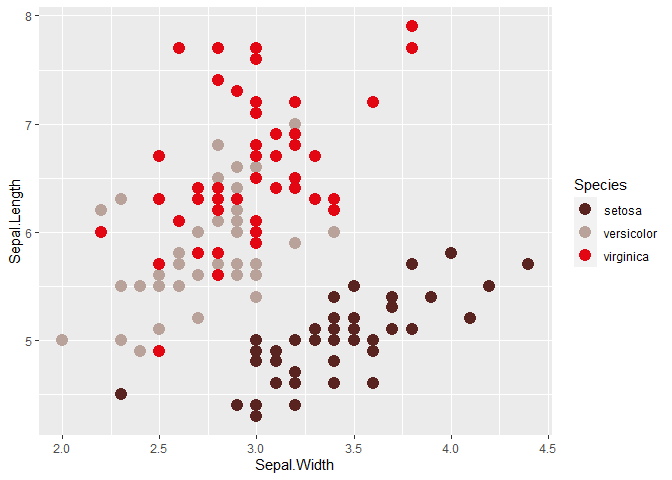
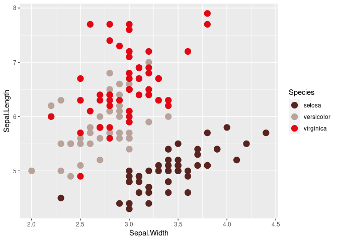
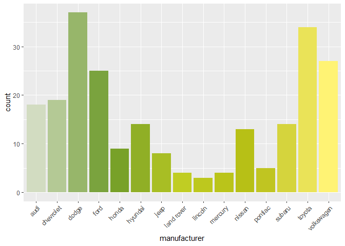

<!-- README.md is generated from README.Rmd. Please edit that file -->

# bizHelpeR

<!-- badges: start -->
<!-- badges: end -->

`bizHelpeR` enthält verschiedene Helferfunktionen für BIZleRinnen und
BIZleR.  
Das sind einerseits die Farben des aktuellen CI/CD sowie einige
Funktionen für den einfachen Einsatz in `ggplot2`.  
Zudem hilft `pdfMergeR()` bei der schnelleren Erstellung der
Rückmeldemappe und der Kombination der verschiedenen PDFs, die für die
Rückmeldung der Testergebnisse nötig sind.

## Installation

Um die aktuelle Version des Packages direkt von
[GitHub](https://github.com/) zu installieren, kannst du in R den
folgenden Code ausführen:

``` r
# install.packages("devtools")
devtools::install_github("DanStuder/bizHelpeR")
```

## Beispiel für die Farben

Es gibt drei Paletten für verschiedene Bereiche: - BIZ allgemein:
“BIZ” - Geschäftsbereich Laufbahn: “LB” - Geschäftsbereich Berufs- und
Studienbberatung: “BSB”

Die Farben der jeweiligen Paletten können mit
`biz_colors(palette = c("BIZ", "BSB", "LB"), ...)` aufgerufen werden:

``` r
library(bizHelpeR)

biz_colors("BIZ")
#>   burgund aubergine dunkelrot   rotgrau rosabeige rosabraun     monza 
#> "#59231F" "#734E4C" "#AA211F" "#B8A29A" "#EDA990" "#AF6753" "#E30613"
biz_colors("LB")
#>    hellgrau lindengruen   graugruen    hellblau    petrol 1    petrol 2 
#>   "#DFD2CF"   "#B4DAC3"   "#A6BAA7"   "#7AC1E3"   "#009CB7"   "#008998" 
#> blaugruen 1 blaugruen 2   stahlblau 
#>   "#299297"   "#007B77"   "#509CB8"
biz_colors("BSB")
#> pastellgruen    grasgruen  gelbgruen 1  gelbgruen 2     hellgelb 
#>    "#D2DCC1"    "#6C9A29"    "#C0CD23"    "#B6BE14"    "#FFF374"
```

Mit `biz_pal(palette = "BIZ", reverse = FALSE, ...)` kannst du die
Reihenfolge der Paletten umkehren und Abstufungen zwischen den gegebenen
Farben auffüllen. Z.B. beinhaltet die Palette “BIZ” 7 Farben, aber
manchmal werden mehr als 7 Farben benötigt:

``` r
biz_pal("BIZ")(12)
#>  [1] "#59231F" "#673A37" "#784947" "#95312F" "#AC3835" "#B47E78" "#C6A397"
#>  [8] "#E3A791" "#D69079" "#B46C58" "#C63A35" "#E30613"
```

Für die Verwendung in `ggplot2` kann mit `scale_color_biz` und
`scale_fill_biz` gearbeitet werden, um ganz einfach die Farben zu
übergeben:

``` r
library(ggplot2)
ggplot(iris, 
       aes(Sepal.Width, 
           Sepal.Length, 
           color = Species)) +
  geom_point(size = 4) +
  scale_color_biz()
```



``` r
ggplot(iris, 
       aes(Sepal.Width, 
           Sepal.Length, 
           color = Sepal.Length)) +
  geom_point(size = 4, 
             alpha = .6) +
  scale_color_biz(discrete = FALSE,
                  palette = "LB")
```



``` r
ggplot(mpg, 
       aes(manufacturer, 
           fill = manufacturer)) +
  geom_bar() +
  theme(axis.text.x = element_text(angle = 45, 
                                   hjust = 1)) +
  scale_fill_biz(palette = "BSB", 
                 guide = "none")
```



## `pdfMergeR()`

Damit die Funktion eingesetzt werden kann, ist folgender Aufbau nötig: -
Ein Ordner mit dem Namen des Moduls (z.B. “A”) - Darin enthalten sind
Unterordner mit den Namen der Testpersonen - Pro Testperson sind drei
Dokumente enthalten: - Rückmeldemappe als Word im Format “Vorname
Nachname Mappe.docx” - PDF mit den Ergebnissen im Format “Vorname
Nachname Ergebnisse.pdf” - PDF mit den Rohdaten im Format “Vorname
Nachname Rohdaten.pdf”

Falls es sich um Modul “VLGK” handelt, muss zusätzlich der Fragebogen im
Format “Vorname Nachname Fragebogen.pdf” abgelegt werden.

Ist diese Struktur für jede Person gegeben, wird die Funktion
aufgerufen:  
`bizHelpeR::pdfMergeR()`

Es öffnet sich ein Fenster, in welchem der Ordner mit dem Modulnamen
angewählt werden muss. Anschliessend wird automatisch aus der
Rückmeldemappe ein PDF generiert und die PDFs kombiniert und
zugeschnitten.

ACHTUNG! Die Funktion überschreibt keine existierenden Dokumente, um
Zeit zu sparen. Wenn ein Dokument (z.B. “… Rückmeldemappe.pdf”) neu
erstellt werden soll, muss die existierende Datei gelöscht werden.
